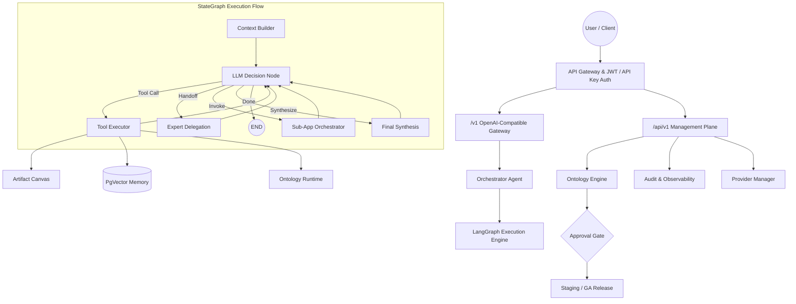

# UniAI Kernel

[English](README.md) | [简体中文](README_zh.md)

**Stop building toy Agent frameworks.**
UniAI Kernel is a **production-grade, multi-tenant Agentic OS Kernel** built on LangGraph & FastAPI. It ships enterprise features — approval workflows, semantic ontology governance, org-level tenancy, and real-time observability — that competitors lock behind paywalls. Fully open-source under Apache 2.0.

[](https://www.python.org/downloads/)
[](https://fastapi.tiangolo.com/)
[](https://langchain-ai.github.io/langgraph/)
[](LICENSE)

---

## 🚀 Why UniAI Kernel?

Most open-source Agent frameworks give you a chat wrapper. UniAI Kernel gives you an **operating system kernel** for AI agents — with the governance, security, and observability that production workloads demand.

| Capability | Toy Frameworks | UniAI Kernel |
|:---|:---:|:---:|
| Multi-agent orchestration | ⚠️ Basic | ✅ Graph-native StateGraph |
| Visual topology editing | ❌ | ✅ Drag-and-drop with snapshots & rollback |
| Approval workflows (Staging → GA) | ❌ | ✅ Built-in governance gates |
| Semantic ontology engine | ❌ | ✅ Schema / Mapping / Rules lifecycle |
| Organization-level multi-tenancy | ❌ | ✅ Org + User isolation |
| Production audit dashboard | ❌ | ✅ Token costs, feedback, stability metrics |
| Runs without a database | ❌ | ✅ Graceful microkernel degradation |

---

## 🧩 System Architecture



---

## ✨ Core Features

### 🧠 Graph-Native Agent Orchestration
- **LangGraph StateGraph Engine**: Non-linear, stateful multi-agent workflows with conditional branching, expert handoffs, and sub-app delegation.
- **Visual Topology Editor**: Drag-and-drop graph designer with Undo/Redo, Dagre auto-layout, node alignment tools, and version snapshots with instant rollback.
- **Swarm Intelligence**: Dynamic multi-agent collaboration — orchestrators delegate to experts, experts invoke sub-orchestrators, all coordinated via semantic routing keywords.
- **Smart Expert Ranking**: Agents are automatically scored on success rate, latency, and quality. Orchestrators prioritize top-performing experts.

### 📐 Enterprise Ontology Engine
- **Schema / Mapping / Rules**: Define entity types, field mappings, and business rules as versionable packages within isolated **Ontology Spaces**.
- **Strict Release Lifecycle**: `Draft → Review → Staging → GA → Deprecated` — each stage optionally gated by human approval workflows.
- **Safe Rollbacks**: Instantly revert to any previous package version with full audit trail.
- **Runtime Evaluation**: Execute mappings and evaluate rules against live data directly from the API or the **Ontology Workbench** UI.
- **Explainability**: Every decision is traceable — use `explain` to replay the reasoning chain for any `decision_id`.

### 🏢 Sovereign Multi-Tenancy
- **Organization-Level Tenancy**: Teams and departments operate in isolated scopes. Members are managed with role-based access (owner, member, admin).
- **User-Level Isolation**: Each user has independent API keys, model configurations, memory sandboxes, and session ownership.
- **Identity Context Tracking**: Every request carries a full identity context (`dashboard_jwt` / `api_key` / `fallback`), persisted into session metadata for end-to-end traceability.
- **Session Ownership Enforcement**: Users only access their own sessions. Admins can view all. Legacy orphan sessions are auto-claimed on upgrade.

### 📊 Production-Grade Observability
- **High-Density Audit Dashboard**: Real-time metrics for token costs, feedback quality (Like/Dislike ratios), error distribution, and agent performance rankings.
- **Multi-Dimensional Filtering**: Slice audit data by tenant, API key, auth source, orchestrator, or specific agent.
- **Node-Level Execution Tracing**: Real-time SSE event streaming for every graph node transition (start/end/error).
- **Agent Scorecards**: Click any agent avatar to see a rich performance dashboard — success rate, avg latency, quality score, and tool proficiency.

### 🔌 Plug-and-Play Extensibility
- **7 Built-in LLM Providers**: OpenAI, Anthropic, Google Gemini, DeepSeek, Groq, Zhipu AI, Qwen — all via LiteLLM's unified interface (100+ models).
- **Dynamic Tool Registry V2**: Hot-load API, MCP, and CLI tools at runtime. Built-in connectivity test suite validates tools before they go live.
- **Native Tools**: `WebSearchTool` (Tavily/Serper with page fetch), `MemorySearchTool` (PgVector RAG), `OntologyTools` (runtime mapping & evaluation), `ArtifactCanvas` (real-time code/markdown rendering).
- **Wildcard Tool Binding**: Configure agents with `*` to auto-inherit all registered tools.

### 🔐 Security & Auth
- **JWT + API Key Dual Auth**: Dashboard users authenticate via JWT; external integrations use scoped API keys with usage tracking.
- **Security Baseline Validation**: On startup, the kernel validates critical security parameters and rejects unsafe configurations.
- **AES-GCM Credential Encryption**: All model API keys are encrypted at rest using Fernet.
- **Feature Flags**: `ENABLE_ONTOLOGY_ENGINE`, `ENABLE_ORG_TENANCY`, `ENABLE_DYNAMIC_CLI_TOOLS` — strict modular control over capabilities.

### 🏗️ Microkernel Architecture
- **Zero-DB Startup**: The kernel boots as a pure LLM proxy without any database. PostgreSQL, Redis, Memory, and Ontology features activate on demand.
- **Industrial Persistence**: PostgreSQL Checkpointer for cross-session state recovery. PgVector for memory sandboxing.
- **Concurrent Safety**: Built-in init locks, DDL timeout protection, and stale connection cleanup for high-availability deployments.

---

## 📂 Project Structure

```text
uniai-kernel/
├── backend/                    # FastAPI Backend
│   ├── app/
│   │   ├── api/endpoints/      # 18 REST endpoints
│   │   ├── agents/             # LangGraph nodes & adaptive router
│   │   ├── ontology/           # Ontology Engine (schema, rules, governance)
│   │   ├── services/           # Business logic layer
│   │   ├── tools/              # Native & dynamic tools
│   │   ├── models/             # SQLAlchemy ORM models
│   │   └── core/               # Config, auth, middleware, DB
│   ├── alembic/                # 20+ database migrations
│   ├── scripts/                # Utility & E2E verification scripts
│   └── tests/                  # Test suite (security, ontology, memory)
├── frontend/                   # React + Vite + Ant Design SPA
│   └── src/components/         # 15 feature components
├── docs/                       # Runbooks & operational guides
├── docker-compose.yml          # Full-stack container orchestration
└── docker-compose.local.yml    # Lightweight local dev infra
```

---

## 🚀 Quick Start

### 1. Install Dependencies

```bash
# Using uv (Recommended)
curl -LsSf https://astral.sh/uv/install.sh | sh
cd backend && uv sync

# Or using pip
pip install -r requirements.txt
```

### 2. Configure Environment

```bash
cp backend/.env.example backend/.env
```

Edit `backend/.env`:

```env
# Database (PostgreSQL + pgvector)
POSTGRES_PASSWORD=your_secure_password
ENCRYPTION_KEY=replace-with-fernet-key  # Generate: python -c "from cryptography.fernet import Fernet; print(Fernet.generate_key().decode())"

# Security
SECRET_KEY=change-this-jwt-secret

# Default LLM (pick any free provider to start)
DEFAULT_LLM_PROVIDER=Qwen
DEFAULT_LLM_MODEL=qwen-flash
DEFAULT_LLM_API_KEY=sk-xxx  # Get from dashscope.aliyuncs.com

# Enterprise Features (optional)
ENABLE_ONTOLOGY_ENGINE=True
ENABLE_ORG_TENANCY=False
```

### 3. Start Services

```bash
# Option A: Docker (Recommended for full stack)
docker-compose up -d

# Option B: Local development
docker-compose -f docker-compose.local.yml up -d  # Start Postgres + Redis
cd backend && uv run uvicorn app.main:app --reload  # Start API
cd frontend && npm install && npm run dev            # Start UI
```

### 4. Access

| Service | URL | Description |
|:--------|:----|:------------|
| **Dashboard** | http://localhost:5173 | Modern management UI |
| **API Docs** | http://localhost:8000/docs | Interactive Swagger documentation |
| **Health Check** | http://localhost:8000/healthz | Liveness probe endpoint |

---

## 🐳 Docker Deployment

### Container Reference

| Service | Container | Port |
|:--------|:----------|:-----|
| Backend API | `uniai-backend` | 8000 |
| PostgreSQL + pgvector | `uniai-pg` | 5432 |
| Redis | `uniai-redis` | 6379 |
| Frontend SPA | `uniai-frontend` | 5173 |

### Common Commands

```bash
docker-compose up -d              # Start all services
docker-compose ps                 # Check status
docker-compose logs -f uniai-backend  # Stream API logs
docker-compose down -v            # Stop and clean up volumes
```

---

## 📚 API Reference

UniAI Kernel exposes three API planes:

### Data Plane — OpenAI-Compatible Gateway
| Endpoint | Method | Description |
|:---------|:-------|:------------|
| `/v1/chat/completions` | POST | Standard chat completions (streaming SSE) |
| `/v1/embeddings` | POST | Vector embeddings generation |

### Management Plane — Kernel Administration
| Endpoint | Method | Description |
|:---------|:-------|:------------|
| `/api/v1/agents/` | CRUD | Agent profile management |
| `/api/v1/agents/{id}/chat` | POST | Agent-specific conversation |
| `/api/v1/providers/` | CRUD | LLM provider configuration |
| `/api/v1/chat-sessions/` | CRUD | Session lifecycle management |
| `/api/v1/memories/` | CRUD | Memory & RAG operations |
| `/api/v1/audit/dashboard` | GET | Comprehensive audit metrics |
| `/api/v1/user/api-keys/` | CRUD | API key management |
| `/api/v1/dynamic-tools/` | CRUD | Runtime tool registration |
| `/api/v1/graph/` | CRUD | Graph topology management |
| `/api/v1/orchestration/` | GET | Orchestration snapshots |

### Ontology Plane — Governance Engine
| Endpoint | Method | Description |
|:---------|:-------|:------------|
| `/api/v1/ontology/spaces` | POST | Create ontology workspace |
| `/api/v1/ontology/schema` | POST | Upsert schema package |
| `/api/v1/ontology/mapping` | POST | Upsert mapping package |
| `/api/v1/ontology/rules` | POST | Upsert rule package |
| `/api/v1/ontology/governance/release` | POST | Release package to target stage |
| `/api/v1/ontology/governance/rollback` | POST | Rollback to previous version |
| `/api/v1/ontology/governance/approvals/submit` | POST | Submit approval request |
| `/api/v1/ontology/governance/approvals/review` | POST | Approve or reject |

Full interactive documentation at `http://localhost:8000/docs`

---

## 📊 Tech Stack

| Layer | Technology | Purpose |
|:------|:-----------|:--------|
| Web Framework | FastAPI | High-performance async API server |
| Agent Orchestration | LangGraph | Graph-native state machine workflows |
| LLM Gateway | LiteLLM | Unified interface for 100+ models |
| Database | PostgreSQL + pgvector | Relational storage + vector search |
| ORM | SQLAlchemy 2.0 (async) | Type-safe database operations |
| Migrations | Alembic | Versioned schema management |
| Cache | Redis | Session caching and rate limiting |
| Frontend | React + Vite + Ant Design | Modern SPA with real-time streaming |
| Auth | JWT + API Key (python-jose) | Dual authentication system |
| Encryption | Fernet (AES-GCM) | Credential encryption at rest |
| Package Manager | uv | Lightning-fast Python dependency management |

---

## 🌟 Supported LLM Providers

### Free Tier

| Provider | Models | Get API Key |
|:---------|:-------|:------------|
| **DeepSeek** | deepseek-chat, deepseek-coder | [platform.deepseek.com](https://platform.deepseek.com) |
| **Groq** | llama-3.1-70b, mixtral-8x7b | [console.groq.com](https://console.groq.com) |
| **Zhipu AI** | glm-4-flash | [open.bigmodel.cn](https://open.bigmodel.cn) |
| **Qwen** | qwen-flash, qwen-turbo, qwen-plus | [dashscope.aliyuncs.com](https://dashscope.aliyuncs.com) |

### Paid Tier

| Provider | Models | Get API Key |
|:---------|:-------|:------------|
| **OpenAI** | gpt-4-turbo, gpt-4o | [platform.openai.com](https://platform.openai.com) |
| **Anthropic** | claude-3, claude-3.5 | [console.anthropic.com](https://console.anthropic.com) |
| **Google** | gemini-pro, gemini-1.5 | [ai.google.dev](https://ai.google.dev) |

---

## 🛠️ Development

### Run Tests

```bash
cd backend

# Security & authorization tests
uv run pytest tests/test_security_authz.py -v

# Ontology governance tests
uv run pytest tests/test_ontology_governance.py -v

# End-to-end ontology verification (requires running DB)
uv run python scripts/verify_ontology_e2e.py
```

### Database Migrations

```bash
cd backend

# Check current migration head
uv run alembic heads

# Apply all migrations
uv run alembic upgrade head

# Create a new migration
uv run alembic revision --autogenerate -m "description"
```

---

## 🔒 Production Deployment

### Security Checklist

1. **Generate strong secrets**:
   ```bash
   # Fernet encryption key
   python -c "from cryptography.fernet import Fernet; print(Fernet.generate_key().decode())"
   # JWT secret
   python -c "import secrets; print(secrets.token_urlsafe(64))"
   ```
2. Set `ENFORCE_PRODUCTION_SECURITY=True` and `ALLOW_ANONYMOUS_ADMIN_FALLBACK=False`
3. Use HTTPS with a reverse proxy (Nginx/Caddy)
4. Restrict database access to internal networks only

### Performance

```bash
gunicorn app.main:app \
  --workers 4 \
  --worker-class uvicorn.workers.UvicornWorker \
  --bind 0.0.0.0:8000
```

---

## 🤝 Contributing

Contributions are welcome! Please read our [Contributing Guide](CONTRIBUTING.md) and [Code of Conduct](CODE_OF_CONDUCT.md) before submitting PRs.

## 📄 License

[Apache License 2.0](LICENSE) — Use it freely, even commercially.

---

**Built with obsession by [Koriginal](https://github.com/Koriginal). If this project saves you time, consider giving it a ⭐.**
