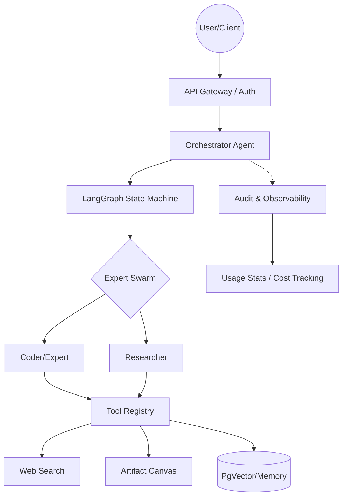

# UniAI Kernel

[English](README.md) | [简体中文](README_zh.md)

**Enterprise-grade Agentic OS Kernel** - A high-performance, multi-tenant AI orchestration engine built with FastAPI and LangGraph. It features a sophisticated Swarm intelligence system, real-time Artifacts visualization, and production-ready observability.

[](https://www.python.org/downloads/)
[](https://fastapi.tiangolo.com/)
[](LICENSE)

---

## 🧩 System Architecture



---

## ✨ Core Features

### 🔌 Multi-tenant Model Management
- **7 Built-in Providers**: DeepSeek, Groq, Zhipu AI, Qwen, OpenAI, Anthropic, Google Gemini
- **User-level Isolation**: Independent API Keys and configurations for each user
- **Quick Environment Setup**: One-click start using `.env`
- **🚀 Graceful Microkernel Architecture**: Completely decoupled core. Starts up perfectly without a database as a pure proxy. All heavy dependencies are loaded on demand.
- **🔌 Pluggable Tool/Plugin Registry**: Seamlessly binds any OpenAI-compatible tool via `PluginRegistry`. Ships natively with `WebSearchTool` and `MemorySearchTool`.
- **🧠 Swarm Multi-Agent Collaboration**: Orchestrate expert agents to solve complex tasks. Supports dynamic handoffs, role-specific prompts, and state-aware transitions.
- **🎨 Artifacts Visual Canvas**: Dedicated side panel for rendering code, HTML, and rich data. Experts can "upsert" to the canvas while chatting.
- **🔑 Multi-Tenant Model Gateway**: Complete with isolated credentials (AES-GCM encryption). Switch between 100+ global models using `LiteLLM`.
- **💾 PgVector Memory Sandboxing**: Long-term preferences extraction and short-term conversation summaries natively isolated for each user.

### 🚀 Developer Friendly
- **Clear APIs**: RESTful design, complete Swagger documentation
- **Type Safety**: Pydantic data validation
- **Streaming Responses**: SSE real-time chat
- **User Authentication Interface**: Pre-reserved clear integration points

### 🎨 Modern Frontend
- **React + Vite**: High-performance SPA architecture
- **Responsive Design**: Mobile-friendly chat interface
- **Real-time Interaction**: Seamless integration with backend SSE streams

---

## 📂 Project Structure

```text
uniai-kernel/
├── backend/                # Backend Core
│   ├── app/                # FastAPI Application
│   │   ├── api/            # Endpoints
│   │   ├── core/           # Logic, Config, Auth
│   │   ├── models/         # SQLAlchemy Models
│   │   ├── services/       # Business Logic
│   │   └── tools/          # Pluggable Tools
│   ├── alembic/            # Database Migrations
│   ├── scripts/            # Utility Scripts
│   ├── tests/              # Test Suite
│   └── .env                # Backend Configuration
├── frontend/               # Modern Frontend (Vite + React)
│   ├── src/                # SPA Source Code
│   └── Dockerfile          # Frontend Build Definition
├── run_backend.py          # Root-level Backend Launcher
├── docker-compose.yml      # Fullstack Orchestration
└── .env.example            # Environment Template
```

---

## 🚀 Quick Start

### 1. Install Dependencies

```bash
# Using uv (Recommended)
curl -LsSf https://astral.sh/uv/install.sh | sh
uv sync

# Or using pip
pip install -r requirements.txt
```

### 2. Configure Environment

Edit the `.env` file:

```env
# Database
POSTGRES_PASSWORD=your_database_password
ENCRYPTION_KEY=your_encryption_key

# Model Configuration (Select a free provider)
DEFAULT_LLM_PROVIDER=Qwen
DEFAULT_LLM_MODEL=qwen-flash
DEFAULT_LLM_API_KEY=sk-xxx  # Obtain from dashscope.aliyuncs.com
```

### 3. Start Service

```bash
# Start Backend Service (Root Level)
python3 run_backend.py

# Or start via VS Code Debugger (Recommended) using the "🚀 运行 UniAI Kernel" launch config.

# Start Frontend Development (Optional)
cd frontend
npm install && npm run dev
```

Visit `http://localhost:5173` to explore the modern UI or `http://localhost:8000/docs` to view the interactive API documentation ✨

### 4. Enterprise-grade Observability
Access the monitoring endpoints to track performance:
- **Usage Stats**: `GET /api/v1/audit/stats?days=7`
- **Full Trace Logs**: `GET /api/v1/audit/actions`
- **Cost Analysis**: Included in every audit log entry.


---

## 🐳 Docker Deployment

### Development Environment (Local)

```bash
# Only start infrastructure
docker-compose up -d postgres redis

# Run API locally (Recommended, supports hot reload)
uv run uvicorn app.main:app --reload
```

### Production Environment (Full Deployment)

```bash
# One-click start all services
docker-compose up -d

# Check service status
docker-compose ps

# View logs
docker-compose logs -f uai-api
```

### Common Commands

```bash
# Start/Stop
docker-compose start
docker-compose stop

# Restart service
docker-compose restart uai-api

# Enter container
docker exec -it uai-pg psql -U root -d agent_db
docker exec -it uai-redis redis-cli

# View logs
docker logs -f uai-api      # API logs
docker logs -f uai-pg        # Database logs

# Clean up
docker-compose down          # Stop and remove containers
docker-compose down -v       # Remove associated volumes
```

### Container Names

| Service | Container Name | Port |
|------|--------|------|
| API | `uai-api` | 8000 |
| PostgreSQL | `uai-pg` | 5432 |
| Redis | `uai-redis` | 6379 |

---

## 💻 Developer Guide

### Invoking Models in Code

#### 1. LLM Chat

```python
from app.core.llm import completion

# Basic Call (Automatically uses user's default model)
response = await completion(
    messages=[
        {"role": "system", "content": "You are a helpful assistant"},
        {"role": "user", "content": "Hello"}
    ],
    user_id="user_001"
)

# Specify Model (Still uses the user's API Key)
response = await completion(
    messages=[...],
    model="gpt-4",
    user_id="user_001"
)

# Streaming Response
async for chunk in await completion(
    messages=[...],
    user_id="user_001",
    stream=True
):
    print(chunk.choices[0].delta.content)
```

#### 2. Embedding Vectors

```python
from app.core.llm import embedding

# Single Text
result = await embedding(
    input="Hello World",
    user_id="user_001"
)
vector = result['data'][0]['embedding']

# Batch Text
result = await embedding(
    input=["Text 1", "Text 2", "Text 3"],
    user_id="user_001"
)
```

#### 3. Memory Retrieval

```python
from app.services.memory_service import memory_service
from app.core.db import get_db

async with get_db() as session:
    # Search for related memories
    memories = await memory_service.search_memories(
        user_id="user_001",
        query="User's profession",
        top_k=5
    )
    
    # Add memory
    await memory_service.add_memory(
        session,
        user_id="user_001",
        content="User is a Python developer",
        category="professional_background"
    )
```

#### 4. Context Management

```python
from app.services.context_service import context_service

# Build complete context (Memory + Session Summary + History)
messages = await context_service.build_context_messages(
    session_id="session_001",
    user_id="user_001",
    current_query="What's the weather like today?",
    db_session=session,
    enable_memory=True,
    enable_session_summary=True
)
```

---

## 🔧 Managing Providers

### List Available Providers

```bash
curl http://localhost:8000/api/v1/providers/templates
```

**Example Response**:
```json
[
  {
    "name": "Qwen",
    "provider_type": "openai",
    "is_free": true,
    "supported_models": ["qwen-turbo", "qwen-plus", "qwen-max", "qwen-flash"]
  }
]
```

### Configure User Providers

```bash
# Method 1: Using API
curl -X POST http://localhost:8000/api/v1/providers/my/providers \
  -H "Content-Type: application/json" \
  -d '{
    "template_name": "OpenAI",
    "api_key": "sk-proj-xxx",
    "custom_config": {}
  }'

# Method 2: Using Environment Variables (Recommended)
# Edit .env
DEFAULT_LLM_PROVIDER=OpenAI
DEFAULT_LLM_MODEL=gpt-4
DEFAULT_LLM_API_KEY=sk-proj-xxx
```

### Set Default Model

```bash
curl -X PUT http://localhost:8000/api/v1/providers/my/default-models \
  -H "Content-Type: application/json" \
  -d '{
    "model_type": "llm",
    "model_name": "gpt-4-turbo",
    "provider_id": 1
  }'
```

---

## 🧠 Intelligent Dialogue Example

### Create Session

```bash
curl -X POST http://localhost:8000/api/v1/chat-sessions/ \
  -H "Content-Type: application/json" \
  -d '{"title": "Technical Consultation", "user_id": "user_001"}'
```

### Start Dialogue

```bash
curl -X POST http://localhost:8000/api/v1/chat \
  -H "Content-Type: application/json" \
  -d '{
    "session_id": "a1b2c3",
    "user_id": "user_001",
    "message": "I am a Python developer, recommend a learning path",
    "enable_memory": true,
    "enable_session_context": true
  }'
```

**Streaming Response** (SSE Format):
```text
data: {"type": "status", "content": "Retrieving memories..."}
data: {"type": "thought", "content": "Loaded user preferences and history"}
data: {"type": "status", "content": "Generating response..."}
data: {"type": "token", "content": "As"}
data: {"type": "token", "content": "a"}
data: {"type": "token", "content": "Python"}
data: {"type": "token", "content": "developer..."}
data: [DONE]
```

---

## 🔐 User Authentication Integration

The framework reserves a clear interface for user authentication, located at `app/core/auth.py`.

### Default Implementation (Single User Mode)

```python
async def get_current_user_id(
    x_user_id: Optional[str] = Header(None)
) -> str:
    return x_user_id or "default_user"
```

### Integrate JWT

```python
from fastapi.security import HTTPBearer
from jose import jwt

security = HTTPBearer()

async def get_current_user_id(
    credentials: HTTPAuthorizationCredentials = Depends(security)
) -> str:
    token = credentials.credentials
    payload = jwt.decode(token, SECRET_KEY, algorithms=["HS256"])
    return payload["user_id"]
```

### Usage in API

```python
from app.core.auth import get_current_user_id

@router.post("/chat")
async def chat(
    request: ChatRequest,
    user_id: str = Depends(get_current_user_id),  # Automatically injected
    db: AsyncSession = Depends(get_db)
):
    # user_id is automatically obtained from the auth system
    ...
```

---

## 📦 Extend Providers

### Add New Template

Edit `app/config/provider_templates.py`:

```python
PROVIDER_TEMPLATES.append({
    "name": "Mistral",
    "provider_type": "mistral",
    "api_base": "https://api.mistral.ai/v1",
    "is_free": False,
    "requires_api_key": True,
    "supported_models": ["mistral-large", "mistral-medium"],
    "description": "Mistral AI Models",
    "config_schema": {
        "api_key": {"required": True, "description": "Mistral API Key"}
    }
})
```

Then run the initialization script:
```bash
uv run python scripts/init_providers.py
```

---

## 🛠️ Utility Scripts

```bash
# Check database status
uv run python scripts/check_db.py

# Reset user config (Troubleshooting)
uv run python scripts/reset_user.py

# Test chat and memory features
uv run python tests/test_chat_memory.py
```

---

## 📊 Tech Stack

| Component | Technology | Description |
|------|------|------|
| Web Framework | FastAPI | High-performance async framework |
| LLM Integration | LiteLLM | Unified interface for 100+ models |
| Database | PostgreSQL + pgvector | Vector storage |
| ORM | SQLAlchemy 2.0 | Async database operations |
| Migrations | Alembic | Database version management |
| Orchestration | LangGraph | State machine workflows |
| Package Manager | uv | Extremely fast python package installer |

---

## 🌟 Supported Providers

### Free Models

| Provider | Model | Website |
|--------|------|----------|
| **DeepSeek** | deepseek-chat | [platform.deepseek.com](https://platform.deepseek.com) |
| **Groq** | llama-3.1-70b | [console.groq.com](https://console.groq.com) |
| **Zhipu AI** | glm-4-flash | [open.bigmodel.cn](https://open.bigmodel.cn) |
| **Qwen** | qwen-flash | [dashscope.aliyuncs.com](https://dashscope.aliyuncs.com) |

### Paid Models

| Provider | Model | Website |
|--------|------|----------|
| **OpenAI** | gpt-4-turbo | [platform.openai.com](https://platform.openai.com) |
| **Anthropic** | claude-3 | [console.anthropic.com](https://console.anthropic.com) |
| **Google** | gemini-pro | [ai.google.dev](https://ai.google.dev) |

---

## 📚 API Endpoints

Full documentation: `http://localhost:8000/docs`

| Endpoint | Method | Description |
|------|------|------|
| `/api/v1/chat` | POST | Intelligent Chat (SSE Streaming) |
| `/api/v1/chat-sessions/` | POST | Create Session |
| `/api/v1/memories/search` | GET | Search Memories |
| `/api/v1/providers/templates` | GET | List Provider Templates |
| `/api/v1/providers/my/providers` | POST | Configure My Provider |
| `/api/v1/providers/my/default-models` | PUT | Set Default Model |
| `/api/v1/users/init` | POST | Initialize New User |

---

## 🔒 Production Deployment

### Security Recommendations

1. **Encryption Key**: Use a strong random `ENCRYPTION_KEY`
   ```bash
   python -c "from cryptography.fernet import Fernet; print(Fernet.generate_key().decode())"
   ```

2. **Database Password**: Use a complex password and restrict access
3. **User Authentication**: Integrate JWT or OAuth2
4. **HTTPS**: Absolute requirement for production environments

### Performance Optimization

```python
# Using Gunicorn + Uvicorn Workers
gunicorn app.main:app \
  --workers 4 \
  --worker-class uvicorn.workers.UvicornWorker \
  --bind 0.0.0.0:8000
```

---

## 🤝 Contributing

PRs and Issues are welcome!

## 📄 License

Apache License 2.0

---

**Happy Coding! 🚀**
