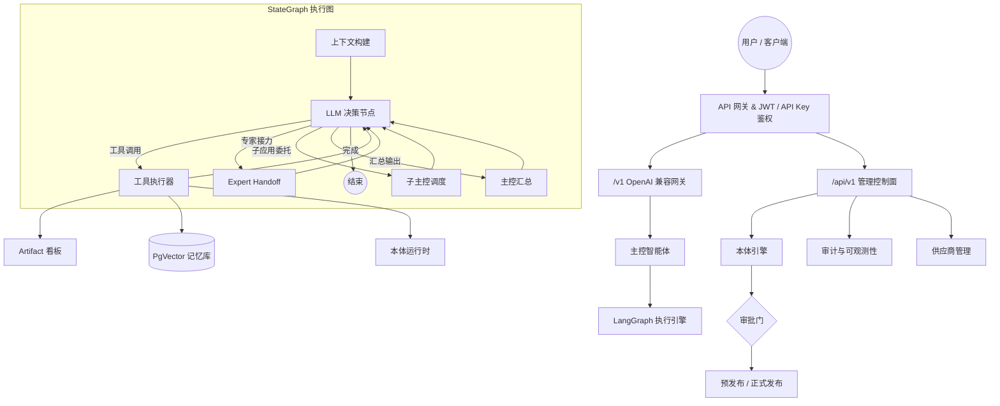

# UniAI Kernel

[English](README.md) | [简体中文](README_zh.md)

**别再用玩具级别的 Agent 框架了。**
UniAI Kernel 是一个基于 LangGraph 和 FastAPI 构建的**生产级多租户 Agent 操作系统内核**。它将竞品锁在付费墙后的企业级特性——审批工作流、语义本体治理、组织级多租户和实时可观测性——完全开源，采用 Apache 2.0 协议。

[](https://www.python.org/downloads/)
[](https://fastapi.tiangolo.com/)
[](https://langchain-ai.github.io/langgraph/)
[](LICENSE)

---

## 🚀 为什么选择 UniAI Kernel？

绝大多数开源 Agent 框架只是给你一个聊天包装器。UniAI Kernel 给你的是 AI 智能体的**操作系统内核**——具备生产负载所需的治理能力、安全隔离和深度可观测性。

| 能力维度 | 玩具级框架 | UniAI Kernel |
|:---|:---:|:---:|
| 多智能体编排 | ⚠️ 基础链式 | ✅ 图原生 StateGraph |
| 可视化拓扑编辑 | ❌ | ✅ 拖拽式设计，快照与回滚 |
| 审批工作流 (Staging → GA) | ❌ | ✅ 内置治理审批门 |
| 语义本体引擎 | ❌ | ✅ Schema / Mapping / Rules 全生命周期 |
| 组织级多租户 | ❌ | ✅ 组织 + 用户双层隔离 |
| 生产级审计看板 | ❌ | ✅ Token 成本、反馈质量、稳定性指标 |
| 无数据库启动 | ❌ | ✅ 微内核优雅降级 |

---

## 🧩 系统架构



---

## ✨ 核心特性

### 🧠 图原生智能体编排
- **LangGraph StateGraph 引擎**：非线性、有状态的多智能体工作流，支持条件分支、专家接力和子应用委托。
- **可视化拓扑编辑器**：拖拽式图形设计器，内置撤销/重做、Dagre 自动布局、节点对齐工具和版本快照，支持一键回滚。
- **Swarm 群体智能**：动态多智能体协作——主控委托执行专家，专家可调用子主控，全程通过语义路由关键词协调。
- **智能专家排名**：基于成功率、延迟和质量自动评分，主控优先调度表现最优的专家。

### 📐 企业级本体引擎 (Ontology Engine)
- **Schema / Mapping / Rules**：在隔离的**本体空间 (Ontology Space)** 中定义实体类型、字段映射和业务规则，所有包均支持版本化管理。
- **严格发布生命周期**：`草稿 → 审核 → 预发布 → 正式发布 → 废弃`——每个阶段可选地由人工审批工作流把关。
- **安全回滚**：即时回退到任意历史版本，完整审计轨迹全程跟踪。
- **运行时执行**：通过 API 或**本体工作台 (Ontology Workbench)** UI 直接对实时数据执行映射和规则评估。
- **可解释性**：每个决策都可追溯——使用 `explain` 接口回放任意 `decision_id` 的完整推理链。

### 🏢 主权级多租户
- **组织级租户模型 (Org Tenancy)**：团队和部门在隔离的作用域内运行，支持基于角色的成员管理（所有者、成员、管理员）。
- **用户级隔离**：每个用户拥有独立的 API Key、模型配置、记忆沙箱和会话所有权。
- **身份上下文追踪**：每个请求携带完整的身份上下文（`dashboard_jwt` / `api_key` / `fallback`），持久化到会话元数据中，实现端到端可追溯。
- **会话所有权强制**：用户只能访问自己的会话。管理员可查看全部。升级时自动认领历史孤儿会话。

### 📊 生产级可观测性
- **高密度审计看板**：实时展示 Token 成本、反馈质量（Like/Dislike 比率）、异常分布和专家效能排名。
- **多维度过滤**：按租户、API Key、鉴权来源、主控或特定专家切片分析审计数据。
- **节点级执行追踪**：实时 SSE 事件流，跟踪每一次图节点跳转（开始/结束/异常）。
- **专家效能评分卡**：点击任何专家头像，查看详细的性能仪表盘——成功率、平均延迟、质量评分和工具专长。

### 🔌 即插即用扩展总线
- **7 大内置 LLM 供应商**：OpenAI, Anthropic, Google Gemini, DeepSeek, Groq, 智谱 AI, 通义千问——全部通过 LiteLLM 统一接口接入（100+ 模型）。
- **动态工具注册 V2**：运行时热装载 API/MCP/CLI 工具，内置连通性测试套件，确保工具上线前通过可用性验证。
- **原生工具集**：`WebSearchTool`（Tavily/Serper 含页面抓取）、`MemorySearchTool`（PgVector RAG 检索）、`OntologyTools`（运行时映射与规则评估）、`ArtifactCanvas`（实时代码/Markdown 看板）。
- **通配符工具绑定**：使用 `*` 配置专家，自动继承所有已注册工具。

### 🔐 安全与鉴权
- **JWT + API Key 双重鉴权**：控制台用户通过 JWT 登录；外部集成使用带用量追踪的 API Key。
- **安全基线校验**：启动时自动检查关键安全参数，拒绝不安全的配置。
- **AES-GCM 凭证加密**：所有模型 API Key 使用 Fernet 加密存储。
- **特性开关 (Feature Flags)**：`ENABLE_ONTOLOGY_ENGINE`、`ENABLE_ORG_TENANCY`、`ENABLE_DYNAMIC_CLI_TOOLS`——严格的模块化能力控制。

### 🏗️ 微内核架构
- **零数据库启动**：内核可以在没有任何数据库的情况下作为纯 LLM 代理启动。PostgreSQL、Redis、记忆和本体功能按需激活。
- **工业级持久化**：PostgreSQL Checkpointer 实现跨会话状态恢复。PgVector 实现记忆沙箱隔离。
- **高并发安全**：内置初始化锁、DDL 超时保护和僵尸连接清理，保障高可用部署。

---

## 📂 项目结构

```text
uniai-kernel/
├── backend/                    # FastAPI 后端
│   ├── app/
│   │   ├── api/endpoints/      # 18 个 REST 端点
│   │   ├── agents/             # LangGraph 节点与自适应路由
│   │   ├── ontology/           # 本体引擎（Schema、Rules、治理）
│   │   ├── services/           # 业务逻辑层
│   │   ├── tools/              # 原生工具与动态工具
│   │   ├── models/             # SQLAlchemy ORM 模型
│   │   └── core/               # 配置、鉴权、中间件、数据库
│   ├── alembic/                # 20+ 数据库迁移脚本
│   ├── scripts/                # 工具脚本与 E2E 验证
│   └── tests/                  # 测试套件（安全、本体、记忆）
├── frontend/                   # React + Vite + Ant Design SPA
│   └── src/components/         # 15 个功能组件
├── docs/                       # 运维手册与操作指南
├── docker-compose.yml          # 全栈容器编排
└── docker-compose.local.yml    # 轻量级本地开发基础设施
```

---

## 🚀 快速开始

### 1. 安装依赖

```bash
# 使用 uv（推荐）
curl -LsSf https://astral.sh/uv/install.sh | sh
cd backend && uv sync

# 或使用 pip
pip install -r requirements.txt
```

### 2. 配置环境

```bash
cp backend/.env.example backend/.env
```

编辑 `backend/.env`：

```env
# 数据库 (PostgreSQL + pgvector)
POSTGRES_PASSWORD=your_secure_password
ENCRYPTION_KEY=replace-with-fernet-key  # 生成：python -c "from cryptography.fernet import Fernet; print(Fernet.generate_key().decode())"

# 安全配置
SECRET_KEY=change-this-jwt-secret

# 默认 LLM（选择任意免费供应商即可启动）
DEFAULT_LLM_PROVIDER=Qwen
DEFAULT_LLM_MODEL=qwen-flash
DEFAULT_LLM_API_KEY=sk-xxx  # 从 dashscope.aliyuncs.com 获取

# 企业特性（可选）
ENABLE_ONTOLOGY_ENGINE=True
ENABLE_ORG_TENANCY=False
```

### 3. 启动服务

```bash
# 方式 A：Docker 全栈（推荐）
docker-compose up -d

# 方式 B：本地开发模式
docker-compose -f docker-compose.local.yml up -d  # 启动 Postgres + Redis
cd backend && uv run uvicorn app.main:app --reload  # 启动 API
cd frontend && npm install && npm run dev            # 启动 UI
```

### 4. 访问

| 服务 | 地址 | 说明 |
|:-----|:-----|:-----|
| **管理控制台** | http://localhost:5173 | 现代化管理界面 |
| **API 文档** | http://localhost:8000/docs | 交互式 Swagger 文档 |
| **健康检查** | http://localhost:8000/healthz | 存活探测端点 |

---

## 🐳 Docker 部署

### 容器参考

| 服务 | 容器名 | 端口 |
|:-----|:-------|:-----|
| 后端 API | `uniai-backend` | 8000 |
| PostgreSQL + pgvector | `uniai-pg` | 5432 |
| Redis | `uniai-redis` | 6379 |
| 前端 SPA | `uniai-frontend` | 5173 |

### 常用命令

```bash
docker-compose up -d                  # 启动所有服务
docker-compose ps                     # 查看状态
docker-compose logs -f uniai-backend  # 实时查看 API 日志
docker-compose down -v                # 停止并清理数据卷
```

---

## 📚 API 参考

UniAI Kernel 暴露三个 API 平面：

### 数据面 — OpenAI 兼容网关
| 端点 | 方法 | 说明 |
|:-----|:-----|:-----|
| `/v1/chat/completions` | POST | 标准对话补全（SSE 流式） |
| `/v1/embeddings` | POST | 向量嵌入生成 |

### 管理面 — 内核管理
| 端点 | 方法 | 说明 |
|:-----|:-----|:-----|
| `/api/v1/agents/` | CRUD | 专家配置管理 |
| `/api/v1/agents/{id}/chat` | POST | 专家专属对话 |
| `/api/v1/providers/` | CRUD | LLM 供应商配置 |
| `/api/v1/chat-sessions/` | CRUD | 会话生命周期管理 |
| `/api/v1/memories/` | CRUD | 记忆与 RAG 操作 |
| `/api/v1/audit/dashboard` | GET | 综合审计指标 |
| `/api/v1/user/api-keys/` | CRUD | API Key 管理 |
| `/api/v1/dynamic-tools/` | CRUD | 运行时工具注册 |
| `/api/v1/graph/` | CRUD | 图拓扑管理 |
| `/api/v1/orchestration/` | GET | 编排快照 |

### 治理面 — 本体引擎
| 端点 | 方法 | 说明 |
|:-----|:-----|:-----|
| `/api/v1/ontology/spaces` | POST | 创建本体空间 |
| `/api/v1/ontology/schema` | POST | 上载 Schema 包 |
| `/api/v1/ontology/mapping` | POST | 上载 Mapping 包 |
| `/api/v1/ontology/rules` | POST | 上载 Rules 包 |
| `/api/v1/ontology/governance/release` | POST | 发布至目标阶段 |
| `/api/v1/ontology/governance/rollback` | POST | 回滚到历史版本 |
| `/api/v1/ontology/governance/approvals/submit` | POST | 提交审批请求 |
| `/api/v1/ontology/governance/approvals/review` | POST | 审批通过或驳回 |

完整交互式文档：`http://localhost:8000/docs`

---

## 📊 技术栈

| 层级 | 技术 | 用途 |
|:-----|:-----|:-----|
| Web 框架 | FastAPI | 高性能异步 API 服务 |
| 智能体编排 | LangGraph | 图原生状态机工作流 |
| LLM 网关 | LiteLLM | 100+ 模型统一接口 |
| 数据库 | PostgreSQL + pgvector | 关系存储 + 向量检索 |
| ORM | SQLAlchemy 2.0 (async) | 类型安全的异步数据库操作 |
| 迁移 | Alembic | 版本化的数据库 Schema 管理 |
| 缓存 | Redis | 会话缓存与速率限制 |
| 前端 | React + Vite + Ant Design | 现代化 SPA + 实时流式交互 |
| 鉴权 | JWT + API Key (python-jose) | 双重认证体系 |
| 加密 | Fernet (AES-GCM) | 凭证静态加密 |
| 包管理 | uv | 极速 Python 依赖管理 |

---

## 🌟 支持的 LLM 供应商

### 免费模型

| 供应商 | 模型 | 获取 API Key |
|:-------|:-----|:-------------|
| **DeepSeek** | deepseek-chat, deepseek-coder | [platform.deepseek.com](https://platform.deepseek.com) |
| **Groq** | llama-3.1-70b, mixtral-8x7b | [console.groq.com](https://console.groq.com) |
| **智谱 AI** | glm-4-flash | [open.bigmodel.cn](https://open.bigmodel.cn) |
| **通义千问** | qwen-flash, qwen-turbo, qwen-plus | [dashscope.aliyuncs.com](https://dashscope.aliyuncs.com) |

### 付费模型

| 供应商 | 模型 | 获取 API Key |
|:-------|:-----|:-------------|
| **OpenAI** | gpt-4-turbo, gpt-4o | [platform.openai.com](https://platform.openai.com) |
| **Anthropic** | claude-3, claude-3.5 | [console.anthropic.com](https://console.anthropic.com) |
| **Google** | gemini-pro, gemini-1.5 | [ai.google.dev](https://ai.google.dev) |

---

## 🛠️ 开发指南

### 运行测试

```bash
cd backend

# 安全与授权测试
uv run pytest tests/test_security_authz.py -v

# 本体治理测试
uv run pytest tests/test_ontology_governance.py -v

# 端到端本体验收（需要运行中的数据库）
uv run python scripts/verify_ontology_e2e.py
```

### 数据库迁移

```bash
cd backend

# 查看当前迁移头
uv run alembic heads

# 应用所有迁移
uv run alembic upgrade head

# 创建新迁移
uv run alembic revision --autogenerate -m "描述"
```

---

## 🔒 生产部署

### 安全清单

1. **生成强密钥**：
   ```bash
   # Fernet 加密密钥
   python -c "from cryptography.fernet import Fernet; print(Fernet.generate_key().decode())"
   # JWT 密钥
   python -c "import secrets; print(secrets.token_urlsafe(64))"
   ```
2. 设置 `ENFORCE_PRODUCTION_SECURITY=True` 和 `ALLOW_ANONYMOUS_ADMIN_FALLBACK=False`
3. 使用 HTTPS 反向代理（Nginx / Caddy）
4. 数据库访问限制在内网

### 性能优化

```bash
gunicorn app.main:app \
  --workers 4 \
  --worker-class uvicorn.workers.UvicornWorker \
  --bind 0.0.0.0:8000
```

---

## 🤝 贡献

欢迎贡献！请在提交 PR 前阅读 [贡献指南](CONTRIBUTING.md) 和 [行为准则](CODE_OF_CONDUCT.md)。

## 📄 开源协议

[Apache License 2.0](LICENSE) — 自由使用，包括商业用途。

---

**由 [Koriginal](https://github.com/Koriginal) 倾力打造。如果这个项目对你有帮助，请给一颗 ⭐ 吧。**