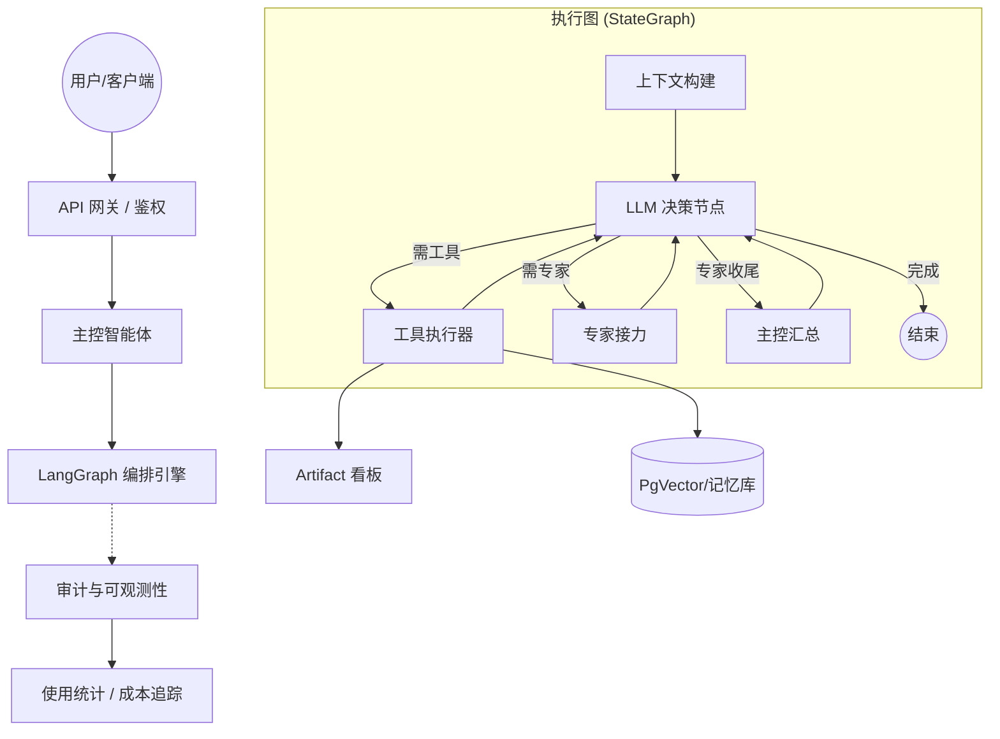

# UniAI Kernel

[English](README.md) | [简体中文](README_zh.md)

**别再用玩具级别的 Agent 框架了。** 
UniAI Kernel 是一个基于 LangGraph 和 FastAPI 构建的**企业级多租户 Agent 操作系统内核**。它将竞品收费的生产级特性（如审批流、组织级多租户、预发布回滚）直接带入开源世界。

[](https://www.python.org/downloads/)
[](https://fastapi.tiangolo.com/)
[](LICENSE)

## 🚀 什么是 UniAI Kernel？

与简单的 API 包装器不同，UniAI 依托 LangGraph 提供了一个**图原生 (Graph-native) 的执行环境**，不仅能实现复杂的多智能体协作，更具备企业级的安全隔离与可观测性。

### 🌟 核心支柱：
*   **图原生编排 (Graph-Native Orchestration)**：构建非线性的状态机 Agent 工作流，支持可视化的拓扑快照保存与无损回滚。
*   **子应用委托与本体治理 (Ontology Governance)**：基于严格语义策略的主控-主控（Orchestrator-to-Orchestrator）任务委托，原生支持 Staging/GA 发版审批流。
*   **生产级可观测性 (Production-Ready Observability)**：内置高密度审计看板，深度洞察 Token 成本、用户反馈质量 (Like/Dislike) 以及系统稳定性。
*   **主权多租户 (Sovereign Multi-tenancy)**：原生支持**组织级 (Organization-level) 租户模型**、独立 API Key 绑定、用户级记忆沙箱隔离及租户视角的统计报表。
*   **即插即用扩展总线 (Plug-and-Play Extensibility)**：通过统一的微内核架构，无缝热拔插任何第三方工具或 LLM 供应商。

---

## 🧩 系统架构



---

## ✨ 核心特性

### 🧠 高级专家治理与动态编排
- **角色化治理**：支持 `主控 (Orchestrator)` 与 `执行专家 (Expert)` 角色区分，内置动态路由关键词匹配与 Handoff 接力策略配置。
- **智能专家排名 (Dynamic Ranking)**：协作名录基于专家效能评分自动排序，优先向主控推荐高成功率、低延迟的精品专家，打造优胜劣汰的协作生态。
- **可视化拓扑编辑器**：集成 **AgentTopologyEditor**，支持对 `StateGraph` 执行流进行可视化编辑、版本快照保存及无损回滚。
- **高并发稳定性保障**：内核内置并发初始化锁与 DDL 超时保护，并支持在数据库不可用时自动降级至默认图，确保极端环境下的系统可用性。

### 🎨 插件总线与数字化治理
- **动态工具 V2 (Dynamic Tools)**：支持 API/MCP/CLI 插件的热装载，并新增**实时连通性测试**总线，确保工具上线即通过可用性验证。
- **专家效能评分卡 (Scorecard)**：点击头像查看数字化 KPI。集成实时审计接口，展示成功率热图、平均耗时趋势及模型质量评分。
- **生产级审计仪表盘**：全天候记录 Agent 思考轨迹、Token 成本、异常分布，支持 QPS 与响应延迟的动态统计。

### 📊 生产级可观测性 (Observability)
- **执行轨迹追踪**：详细记录每一次节点跳转、工具调用及任务嵌套的完整生命周期。
- **成本与用量监控**：实时计算 Token 消耗并根据模型单价预估单次请求成本 (USD)。
- **分析仪表盘**：内置 API 支持 QPS、响应耗时、成功率等维度的统计分析。

### 🔑 多租户模型网关
- **企业级安全**：所有模型凭证均通过 AES-GCM 高强度加密存储。
- **动态分发**：基于 LiteLLM 轻松接入 100+ 全球主流模型（OpenAI, Anthropic, DeepSeek, 智谱等）。
- **极简微内核**：支持无数据库纯代理模式秒级启动，重型依赖按需挂载。

### 🔌 扩展与存储
- **原生 Tool/Plugin 扩展总线**：通过 `PluginRegistry` 无缝装载任何兼容 OpenAI Tool Calling 的函数，内置了基于网络搜索的 `WebSearchTool` 与基于私有库的 `MemorySearchTool`。
- **💾 PgVector 底层 RAG 与记忆隔离**：使用 PostgreSQL 原生的向量计算功能，为不同租户安全存放短期会话摘要和长期提炼偏好。
- **类型安全**：Pydantic 数据验证
- **流式响应**：SSE 实时对话
- **用户认证接口**：预留清晰的集成点

---

## 📂 项目结构

```
uniai-kernel/
├── backend/                # 后端核心
│   ├── app/                # FastAPI 应用
│   │   ├── api/            # 接口定义
│   │   ├── core/           # 核心逻辑
│   │   ├── models/         # 数据库模型
│   │   ├── services/       # 业务逻辑
│   │   └── tools/          # 插件工具
│   ├── alembic/            # 数据库迁移
│   ├── scripts/            # 工具脚本
│   ├── tests/              # 测试套件
│   └── .env                # 后端私有配置
├── frontend/               # 现代化前端 (Vite + React)
│   ├── src/                # SPA 源码
│   └── Dockerfile          # 前端镜像定义
├── run_backend.py          # 根目录后端启动器
├── docker-compose.yml      # 全栈容器编排
└── .env.example            # 环境变量模板
```

---

## 🚀 快速开始

### 1. 安装依赖

```bash
# 使用 uv（推荐）
curl -LsSf https://astral.sh/uv/install.sh | sh
uv sync

# 或使用 pip
pip install -r requirements.txt
```

### 2. 配置环境

编辑 `.env` 文件：

```env
# 数据库
POSTGRES_PASSWORD=your_database_password
ENCRYPTION_KEY=your_encryption_key

# 模型配置（选择一个免费供应商）
DEFAULT_LLM_PROVIDER=通义千问
DEFAULT_LLM_MODEL=qwen-flash
DEFAULT_LLM_API_KEY=sk-xxx  # 从 dashscope.aliyuncs.com 获取
```

### 3. 启动服务

```bash
# 启动后端服务 (推荐：在项目根目录运行)
python3 run_backend.py

# 或者通过 VS Code 的 "🚀 运行 UniAI Kernel" 调试项启动。

# 启动前端开发环境 (可选)
cd frontend
npm install && npm run dev
```

访问 `http://localhost:5173` 体验现代化图形界面，或访问 `http://localhost:8000/docs` 查看交互式 API 文档 ✨

### 4. 生产级可观测性监控
通过内置接口实时追踪系统运行状态：
- **使用统计分析**：`GET /api/v1/audit/stats?days=7`
- **全链路行动日志**：`GET /api/v1/audit/actions`
- **成本详情**：每条审计日志均包含详细的 Token 消耗及美元成本预估。


---

## 🐳 Docker 部署

### 开发环境（本地）

```bash
# 仅启动基础设施
docker-compose up -d postgres redis

# 本地运行 API（推荐，支持热重载）
uv run uvicorn app.main:app --reload
```

### 生产环境（完整部署）

```bash
# 一键启动所有服务
docker-compose up -d

# 查看服务状态
docker-compose ps

# 查看日志
docker-compose logs -f uai-api
```

### 常用命令

```bash
# 启动/停止
docker-compose start
docker-compose stop

# 重启服务
docker-compose restart uai-api

# 进入容器
docker exec -it uai-pg psql -U root -d agent_db
docker exec -it uai-redis redis-cli

# 查看日志
docker logs -f uai-api      # API 日志
docker logs -f uai-pg        # 数据库日志

# 清理
docker-compose down          # 停止并删除容器
docker-compose down -v       # 同时删除数据卷
```

### 容器名称

| 服务 | 容器名 | 端口 |
|------|--------|------|
| API | `uai-api` | 8000 |
| PostgreSQL | `uai-pg` | 5432 |
| Redis | `uai-redis` | 6379 |

---

## 💻 开发者指南

### 在代码中调用模型

#### 1. LLM 对话

```python
from app.core.llm import completion

# 基础调用（自动使用用户默认模型）
response = await completion(
    messages=[
        {"role": "system", "content": "你是一个助手"},
        {"role": "user", "content": "你好"}
    ],
    user_id="user_001"
)

# 指定模型（仍使用用户的 API Key）
response = await completion(
    messages=[...],
    model="gpt-4",
    user_id="user_001"
)

# 流式响应
async for chunk in await completion(
    messages=[...],
    user_id="user_001",
    stream=True
):
    print(chunk.choices[0].delta.content)
```

#### 2. Embedding 向量

```python
from app.core.llm import embedding

# 单个文本
result = await embedding(
    input="你好世界",
    user_id="user_001"
)
vector = result['data'][0]['embedding']

# 批量文本
result = await embedding(
    input=["文本1", "文本2", "文本3"],
    user_id="user_001"
)
```

#### 3. 记忆检索

```python
from app.services.memory_service import memory_service
from app.core.db import get_db

async with get_db() as session:
    # 搜索相关记忆
    memories = await memory_service.search_memories(
        user_id="user_001",
        query="用户的职业",
        top_k=5
    )
    
    # 添加记忆
    await memory_service.add_memory(
        session,
        user_id="user_001",
        content="用户是Python开发者",
        category="professional_background"
    )
```

#### 4. 上下文管理

```python
from app.services.context_service import context_service

# 构建完整上下文（记忆 + 会话摘要 + 历史）
messages = await context_service.build_context_messages(
    session_id="session_001",
    user_id="user_001",
    current_query="今天天气怎么样",
    db_session=session,
    enable_memory=True,
    enable_session_summary=True
)
```

---

## 🔧 管理供应商

### 查看可用供应商

```bash
curl http://localhost:8000/api/v1/providers/templates
```

**返回示例**：
```json
[
  {
    "name": "通义千问",
    "provider_type": "openai",
    "is_free": true,
    "supported_models": ["qwen-turbo", "qwen-plus", "qwen-max", "qwen-flash"]
  }
]
```

### 配置用户供应商

```bash
# 方式1：通过 API
curl -X POST http://localhost:8000/api/v1/providers/my/providers \
  -H "Content-Type: application/json" \
  -d '{
    "template_name": "OpenAI",
    "api_key": "sk-proj-xxx",
    "custom_config": {}
  }'

# 方式2：通过环境变量（推荐）
# 编辑 .env
DEFAULT_LLM_PROVIDER=OpenAI
DEFAULT_LLM_MODEL=gpt-4
DEFAULT_LLM_API_KEY=sk-proj-xxx
```

### 设置默认模型

```bash
curl -X PUT http://localhost:8000/api/v1/providers/my/default-models \
  -H "Content-Type: application/json" \
  -d '{
    "model_type": "llm",
    "model_name": "gpt-4-turbo",
    "provider_id": 1
  }'
```

---

## 🧠 智能对话示例

### 创建会话

```bash
curl -X POST http://localhost:8000/api/v1/chat-sessions/ \
  -H "Content-Type: application/json" \
  -d '{"title": "技术咨询", "user_id": "user_001"}'
```

### 开始对话

```bash
curl -X POST http://localhost:8000/api/v1/chat \
  -H "Content-Type: application/json" \
  -d '{
    "session_id": "a1b2c3",
    "user_id": "user_001",
    "message": "我是Python开发者，推荐学习路径",
    "enable_memory": true,
    "enable_session_context": true
  }'
```

**流式响应**（SSE 格式）：
```
data: {"type": "status", "content": "正在检索记忆..."}
data: {"type": "thought", "content": "已加载用户偏好和历史记忆"}
data: {"type": "status", "content": "正在生成回答..."}
data: {"type": "token", "content": "作为"}
data: {"type": "token", "content": "Python"}
data: {"type": "token", "content": "开发者..."}
data: [DONE]
```

---

## 🔐 用户认证集成

框架预留了清晰的用户认证接口，位于 `app/core/auth.py`。

### 默认实现（单用户模式）

```python
async def get_current_user_id(
    x_user_id: Optional[str] = Header(None)
) -> str:
    return x_user_id or "default_user"
```

### 集成 JWT

```python
from fastapi.security import HTTPBearer
from jose import jwt

security = HTTPBearer()

async def get_current_user_id(
    credentials: HTTPAuthorizationCredentials = Depends(security)
) -> str:
    token = credentials.credentials
    payload = jwt.decode(token, SECRET_KEY, algorithms=["HS256"])
    return payload["user_id"]
```

### 在 API 中使用

```python
from app.core.auth import get_current_user_id

@router.post("/chat")
async def chat(
    request: ChatRequest,
    user_id: str = Depends(get_current_user_id),  # 自动注入
    db: AsyncSession = Depends(get_db)
):
    # user_id 已自动从认证系统获取
    ...
```

---

## 📦 扩展供应商

### 添加新模板

编辑 `app/config/provider_templates.py`：

```python
PROVIDER_TEMPLATES.append({
    "name": "Mistral",
    "provider_type": "mistral",
    "api_base": "https://api.mistral.ai/v1",
    "is_free": False,
    "requires_api_key": True,
    "supported_models": ["mistral-large", "mistral-medium"],
    "description": "Mistral AI 模型",
    "config_schema": {
        "api_key": {"required": True, "description": "Mistral API Key"}
    }
})
```

然后运行初始化脚本：
```bash
uv run python scripts/init_providers.py
```

---

## 🛠️ 工具脚本

```bash
# 检查数据库状态
uv run python scripts/check_db.py

# 重置用户配置（故障排查）
uv run python scripts/reset_user.py

# 测试聊天和记忆功能
uv run python tests/test_chat_memory.py
```

---

## 📊 技术栈

| 组件 | 技术 | 说明 |
|------|------|------|
| Web 框架 | FastAPI | 高性能异步框架 |
| LLM 集成 | LiteLLM | 统一100+模型接口 |
| 数据库 | PostgreSQL + pgvector | 向量存储 |
| ORM | SQLAlchemy 2.0 | 异步数据库操作 |
| 迁移 | Alembic | 数据库版本管理 |
| 编排 | LangGraph | 状态机工作流 |
| 依赖管理 | uv | 极速包管理器 |

---

## 🌟 支持的供应商

### 免费模型

| 供应商 | 模型 | 获取地址 |
|--------|------|----------|
| **DeepSeek** | deepseek-chat | [platform.deepseek.com](https://platform.deepseek.com) |
| **Groq** | llama-3.1-70b | [console.groq.com](https://console.groq.com) |
| **智谱AI** | glm-4-flash | [open.bigmodel.cn](https://open.bigmodel.cn) |
| **通义千问** | qwen-flash | [dashscope.aliyuncs.com](https://dashscope.aliyuncs.com) |

### 付费模型

| 供应商 | 模型 | 获取地址 |
|--------|------|----------|
| **OpenAI** | gpt-4-turbo | [platform.openai.com](https://platform.openai.com) |
| **Anthropic** | claude-3 | [console.anthropic.com](https://console.anthropic.com) |
| **Google** | gemini-pro | [ai.google.dev](https://ai.google.dev) |

---

## 📚 API 端点

完整文档：`http://localhost:8000/docs`

| 端点 | 方法 | 说明 |
|------|------|------|
| `/api/v1/chat` | POST | 智能对话（SSE 流式） |
| `/api/v1/chat-sessions/` | POST | 创建会话 |
| `/api/v1/memories/search` | GET | 搜索记忆 |
| `/api/v1/providers/templates` | GET | 查看供应商模板 |
| `/api/v1/providers/my/providers` | POST | 配置我的供应商 |
| `/api/v1/providers/my/default-models` | PUT | 设置默认模型 |
| `/api/v1/users/init` | POST | 初始化新用户 |

---

## 🔒 生产部署

### 安全建议

1. **加密密钥**：使用强随机的 `ENCRYPTION_KEY`
   ```bash
   python -c "from cryptography.fernet import Fernet; print(Fernet.generate_key().decode())"
   ```

2. **数据库密码**：使用复杂密码并限制访问
3. **用户认证**：集成 JWT 或 OAuth2
4. **HTTPS**：生产环境必须使用 HTTPS

### 性能优化

```python
# 使用 Gunicorn + Uvicorn Workers
gunicorn app.main:app \
  --workers 4 \
  --worker-class uvicorn.workers.UvicornWorker \
  --bind 0.0.0.0:8000
```

---

## 🤝 贡献

欢迎 PR 和 Issue！

## 📄 License

Apache License 2.0

---

**Happy Coding! 🚀**